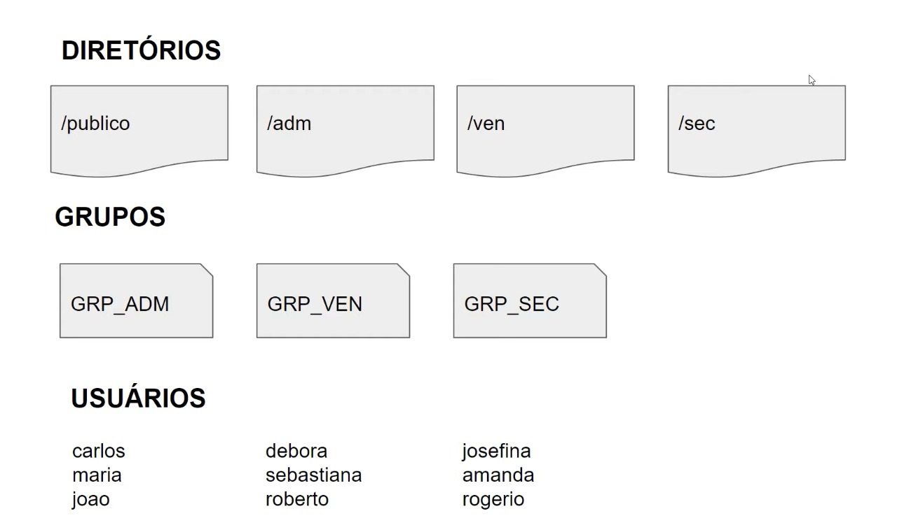

# Shell script para criação de usuários, grupos, diretórios com respectivas permissões.

## Diretivas 📢

- Todos usuários terão permissão dentro do diretório public;
- Os usuários de cada grupo terão permissão total dentro do seu respectivo diretório;
- Os usuários não poderão ter permissão de leitura, escrita e execução em diretórios de depertamentos que eles não pertencem;

## Escopo 🔨

